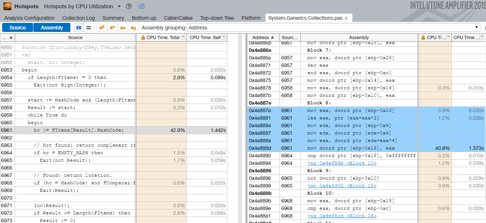

# map2pdb

## Generating Microsoft PDB files from  Delphi and C++ Builder MAP files

Copyright (c) 2021 Anders Melander

**map2pdb** is a tool used to convert the MAP files produced by the Delphi and C++ Builder compilers to Microsoft PDB files for use in [tools that support that format](#markdown-header-tools-that-consume-pdb-files).



map2pdb is written in pure Delphi with no dependencies on other libraries or tools. Unlike other similar solutions it does not [rely on the undocumented Visual Studio DLLs](https://github.com/rainers/cv2pdb/blob/master/src/mspdb.cpp) to build and write the PDB file.

### Usage

map2pdb is a console mode application. To use it you simply run it from the command line with the appropriate parameters. You can also add it to the Tools menu inside the Delphi or C++ Builder IDE so it's easily available there. More on that below.

```
map2pdb [options] <map-filename>
```

| Option | Meaning |
|--------|---------|
| `-pdb[:<output-filename>]` | Writes a PDB file (default) |
| `-yaml[:<output-filename>]` | Writes an YAML file that can be used with `llvm-pdbutil yam2pdb` |
| `-bind[:<filename>]` | Patches the specified exe/dll file to include a reference to the PDB file |
| `-include:<filters>` | Only include data that satisfies the specified filters in the PDB |
| `-exclude:<filters>` | Exclude data that satisfies the specified filter from the PDB |
| `-v` | Print verbose output |
| `-debug` | Print debug information |
| `-pause` | Prompt after completion |

The order of parameters is not significant.

#### Filters

Filters can be used to limit the size of the produced PDB. This can be necessary either because of memory constraints or because some tools (I'm looking at you, VTune) get very slow with large PDB files.

Filters are applied after the map file has been imported but before the PDB is produced. More than one filter can be specified.

First the include filters are applied; Everything that doesn't satisfy the include filter is excluded from the PDB. Then the exclude filters are applied; Everything that satisfies the exclude filter is excluded from the PDB.

##### Module filter

A module filter specifies the names of modules (units in Delphi terms) to include or exclude from the PDB. Wildcards are supported and multiple filenames can be specified by separating them with semicolons.  
For example to exclude all DevExpress units and Firedac:  

```
  -exclude:dx*;cx*;firedac.*
```

##### Segment filter

A segment filter specifies the index value of segments/sections to include or exclude from the PDB. The list of segments can be found at the very top of the MAP file.  
Most of the code is typically located in segment 0001 so a common filter would be:  
```
  -include:0001
```

In order for a filter to be recognized as a segment filter it must consist of 4 hexadecimal digits.

#### Examples

* Read from foobar.map, create foobar.pdb, patch foobar.exe to reference foobar.pdb and only include symbols from segment 0001 but ignore all units starting with "dx" or "cx":  
  ```
  map2pdb -include:0001 -exclude:dx*;cx* -bind foobar.map
  ```

* Read from mypackage.map, create mypackage.pdb and patch mypackage.bpl to reference mypackage.pdb:  
  ```
  map2pdb -bind:mypackage.bpl mypackage.map
  ```
  
### Requirements

Since map2pdb uses the information in your project's MAP file to generate the PDB file, you need to link your projects with a **Detailed** map file. You do not need to link with debug information but the detailed MAP file is required. Additionally you should compile with full **Debug Information** enabled since this controls if the MAP file will contain line number information or not.  
None of these options will affect the final output of your compiled project; They only affect the debug information which is stored in the MAP and DCU files.

You enable the Detailed MAP file in your project's [linker options](http://docwiki.embarcadero.com/RADStudio/Sydney/en/Linking) and the Debug information in the project's [compiler options](http://docwiki.embarcadero.com/RADStudio/Sydney/en/Compiling#Debugging_Options).

### Delphi and C++ Builder integration

1. From the "Tools" menu select "Configure Tools...".
2. Select "Add...".
3. Give the tool a name. E.g. "map2pdb".
4. In the "Program" field specify the complete path to the `map2pdb.exe` file.
5. In the "Parameters" field write the following:  
    `-pause -bind:$EXENAME $PATH($EXENAME)$NAMEONLY($EXENAME).map`
6. Close the dialog.

You should now have a new menu item in the Tools menu. When you have compiled your project and want to generate a PDB file you can now just use this menu item to do so.

The purpose of the **-pause** switch in the example above is to enable you to see what's happening. Without it the command window would just open briefly and then close when map2pdb was done. You can remove it if you don't need that.  
Of course you can also add whatever additional parameters you need.

### References

The following resources was used as references and inspiration during development of map2pdb:

- [Microsoft pdb](https://github.com/Microsoft/microsoft-pdb)  
  Incomplete source code "documenting" the PDB file format.

- [llvm's PDB documentation](https://llvm.org/docs/PDB/)  
  Nice but incomplete documentation of the PDB and MSF file formats.

- [Epoch](https://github.com/apoch/epoch-language/blob/renewal/EpochCompiler/Linker/PDB.epoch)  
  The Epoch compiler/linker contains an incomplete PDB writer.

- [Matching debug information](http://www.debuginfo.com/articles/debuginfomatch.html)  
  Information about how the PDB file is associated with an EXE file.

### Tools

#### PDB forensic tools

- [llvm-pdbutil](https://llvm.org/docs/CommandGuide/llvm-pdbutil.html)  
  Used to validate, read and (partially) write PDB files and dump the information in various formats.  
  Unofficial downloads here: https://github.com/shaharv/llvm-pdbutil-builds/releases
  
- [cvdump](https://github.com/microsoft/microsoft-pdb/tree/master/cvdump)  
  Microsoft's cvdump utilty. Used to validate and read PDB files and dump the information in text format.

#### Tools that consume PDB files

- [Intel VTune profiler](https://software.intel.com/content/www/us/en/develop/tools/oneapi/components/vtune-profiler.html)
- [AMD μProf profiler](https://developer.amd.com/amd-uprof/)
- [WinDbg debugger](https://docs.microsoft.com/en-us/windows-hardware/drivers/debugger/debugger-download-tools)
- [OllyDbg debugger](http://www.ollydbg.de/)

##### Performance problems with Intel VTune

Due to a bug in the **msdia140.dll** file that comes bundled with VTune you will likely experience that VTune takes an extremely long time to resolve symbols on anything but the smallest projects.

msdia140.dll implements the [Debug Interface Access SDK](https://docs.microsoft.com/en-us/visualstudio/debugger/debug-interface-access/debug-interface-access-sdk?view=vs-2019). The bug was introduced in VS2017 and supposedly fixed in VS2019 but apparently Intel hasn't caught up to that fact and new versions of VTune still comes with the old VS2017 version of msdia140.dll.

To fix this problem all you have to do is replace VTune's msdia140.dll with a newer version. The file is located in the bin32 and bin64 folders under the VTune root folder. Note that the 32-bit and 64-bit files are not the same. You need to replace the file in the bin32 folder with the 32-bit version of msdia140.dll and the one in the bin64 folder with the 64-bit version.

Now here's the catch; The files you need to replace are not the ones that are actually named msdia140.dll. You need to replace the ones named **amplxe_msdia140.dll**. Remember to save the old ones first in case you mess this up.

If you have a newer version of VS installed you can probably find the required files somewhere on your system. I guess anything newer than version 14.10.x.x should do. You can also install the [Visual Studio Redistributable](https://visualstudio.microsoft.com/downloads/#microsoft-visual-c-redistributable-for-visual-studio-2019) and get the files from there or you can just get the two files from the [repository download section](https://bitbucket.org/anders_melander/map2pdb/downloads/).

### Building map2pdb from source

The source requires Delphi 10.3 or later and will not compiler with older versions due to the language features used (inline vars).

To build map2pdb just open `map2pdb.dproj` in Delphi, build and you're done.

### Download

A precompiled map2pdb.exe can be downloaded here: https://bitbucket.org/anders_melander/map2pdb/downloads/  
It has been virus scanned locally with BitDefender and remotely with [VirusTotal](https://www.virustotal.com).

### License

The source code is released under the MPL 2.0 license:

> Copyright © 2021 Anders Melander  
> This Source Code Form is subject to the terms of the Mozilla Public  
> License, v. 2.0. If a copy of the MPL was not distributed with this  
> file, You can obtain one at http://mozilla.org/MPL/2.0/.